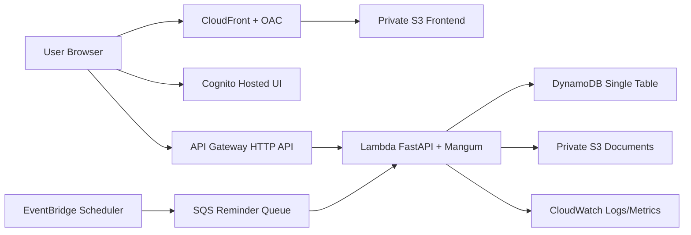

# Architecture

- API Gateway validates JWT against Cognito and required API scopes.
- Backend enforces capability + record-level authorization using Cognito groups + DynamoDB scopes.
- Sensitive requests use bounded authorization revocation via user status/authz version check.

